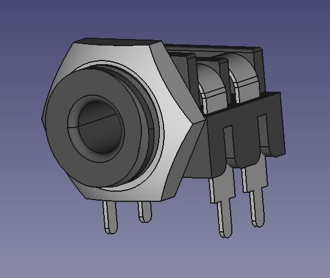

# Library Data

This file contains information about the parts that is not needed for KiCAD but is a reference for designers. 

| Manufacturer | Part Number   | Connector Type   | Reccomended KiCAD Symbol | Mounting orientation | Testing Status |
|--------------|---------------|------------------|--------------------------|----------------------|----------------|
| Cliff        | FCR1281       | 3.5mm Mono TS    | AudioJack2_Ground_Switch | Horizontal           | Untested       |
| QuingPu      | WQP-PJ301BM   | 3.5mm Mono TS    | AudioJack2_SwitchT       | Vertical             | Untested       |
| QuingPu      | WQP-PJ301CM   | 3.5mm Stereo TRS | AudioJack3               | Vertical             | Untested       |
| QuingPu      | WQP-PJ301M-12 | 3.5mm Mono TS    | AudioJack2_SwitchT       | Vertical             | Untested       |
| QuingPu      | WQP-PJ302M    | 3.5mm Mono TS    | AudioJack2_SwitchT       | Horizontal           | Untested       |
| QuingPu      | WQP-PJ366ST   | 3.5mm Stereo TRS | AudioJack2_SwitchT       | Vertical             | Untested       |
| QuingPu      | WQP-PJ398SM   | 3.5mm Mono TS    | AudioJack3               | Vertical             | Untested       |
| QuingPu      | WQP-PJ3410    | 3.5mm Stereo TRS | AudioJack3_SwitchTR      | Vertical             | Untested       |

Testing status is either "Untested", "Print out confirmed" or "PCB Confirmed". Untested is self expanitory, print is that I have printed an image and tested it against the real component and PCB is that I have manufactured and soldered in the real part as a test.

# Notes
Here is a summary of the contents, please not they may not be the original manufacturers but where I sourced the reference connector.

### Cliff FCR1281 / CL1384
Common type used on Doepfer and Expert Sleepers

### QuingPu PJ301BM
Sheilded connector a little like the PJ398SM, popularised by [Earthenvar](http://erthenvar.com/blog/improved-jacks-now-shipping/)

### QuingPu PJ301CM
Stereo jack

### QuingPu PJ302M
Commonly used side mounting mono jack in Eurorack

### QuingPu PJ366ST
Stereo jack in a similar shape to PJ398SM but not exactly the same

### QuingPu PJ398SM
AKA [Thonkiconn](https://www.thonk.co.uk), very commonly used eurorack jack sold by many suppliers like Thonk. 3D model options with Knurled nut, hex nut and no nut.

### QuingPu PJ301M-12
The original "Thonkiconn" looks a little different (different 3D model) but same footprint as PJ398SM

### QuingPu PJ3410
'NV' jack (Kits by ['NV'](https://www.muffwiggler.com/forum/viewtopic.php?t=79912) on Muffwiggler) Taller vertical mount 3.5mm jack. KiCAD does not have the correct schematic symbol it should be AudioJack3_SwitchT but it does not exist.